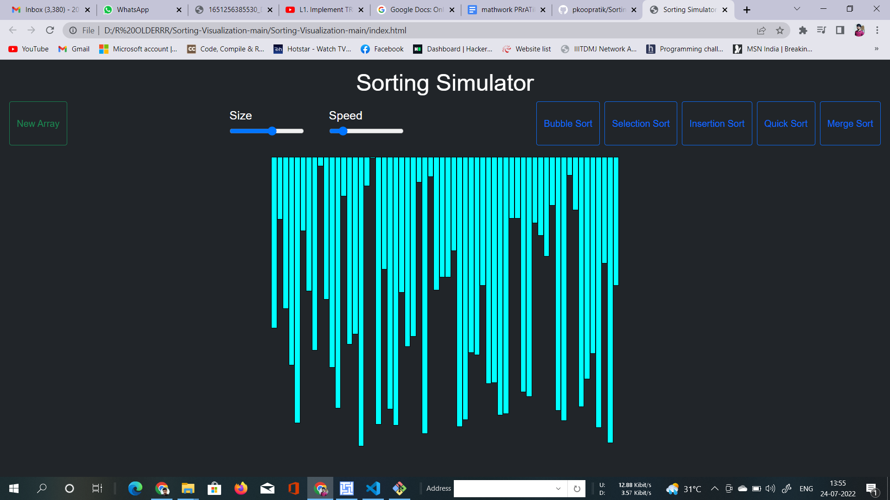
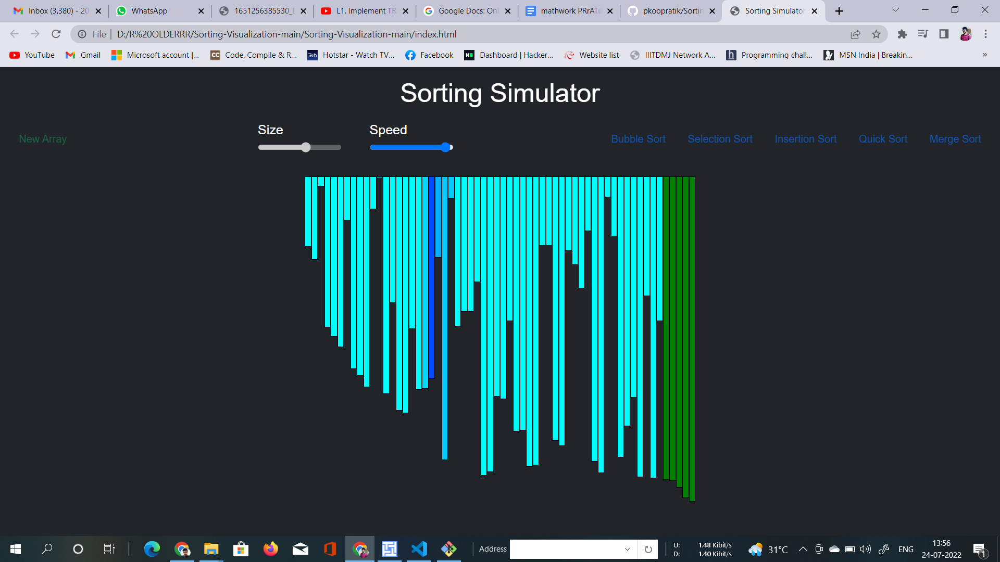
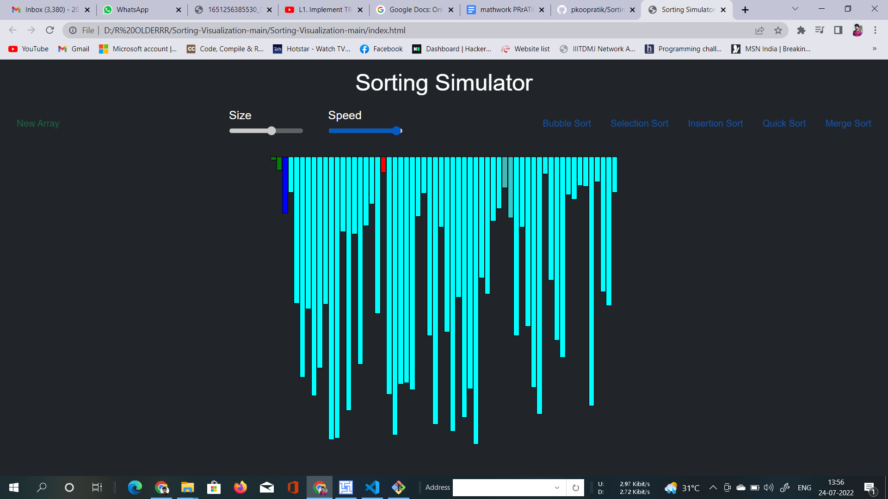

# Sorting Visualization

### This is a simple visualization project made using javascript 
- Bubble Sort 
- Selection Sort
- Insertion Sort
- Quick Sort
- Merge Sort

# Can be used for various arrays of integer
# We can give any array as an input
# We can change size of array
# We can increase or decrease speed of simulation

### This is built using HTML, CSS, JavaScript  

  
  
  
